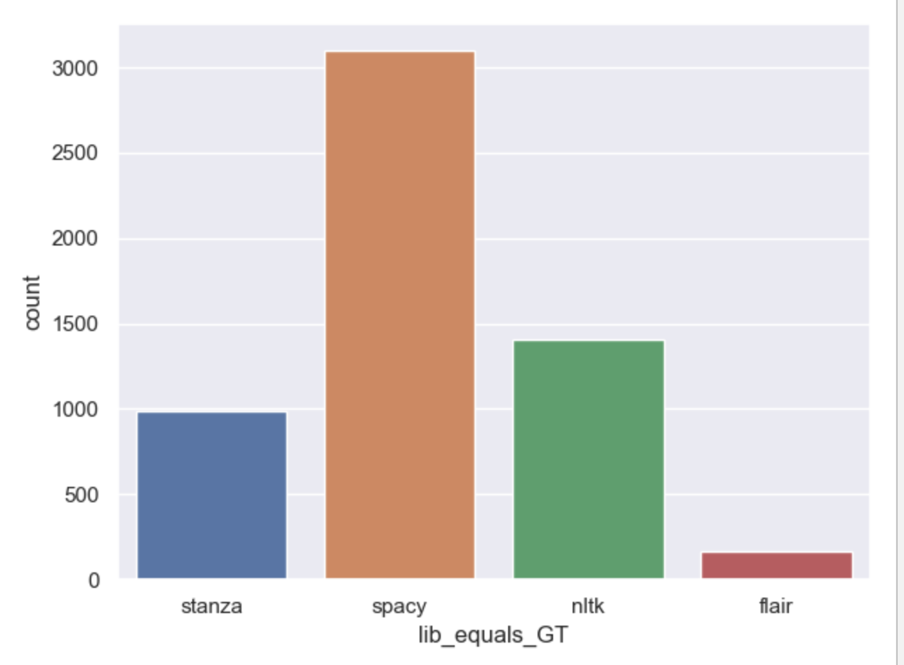
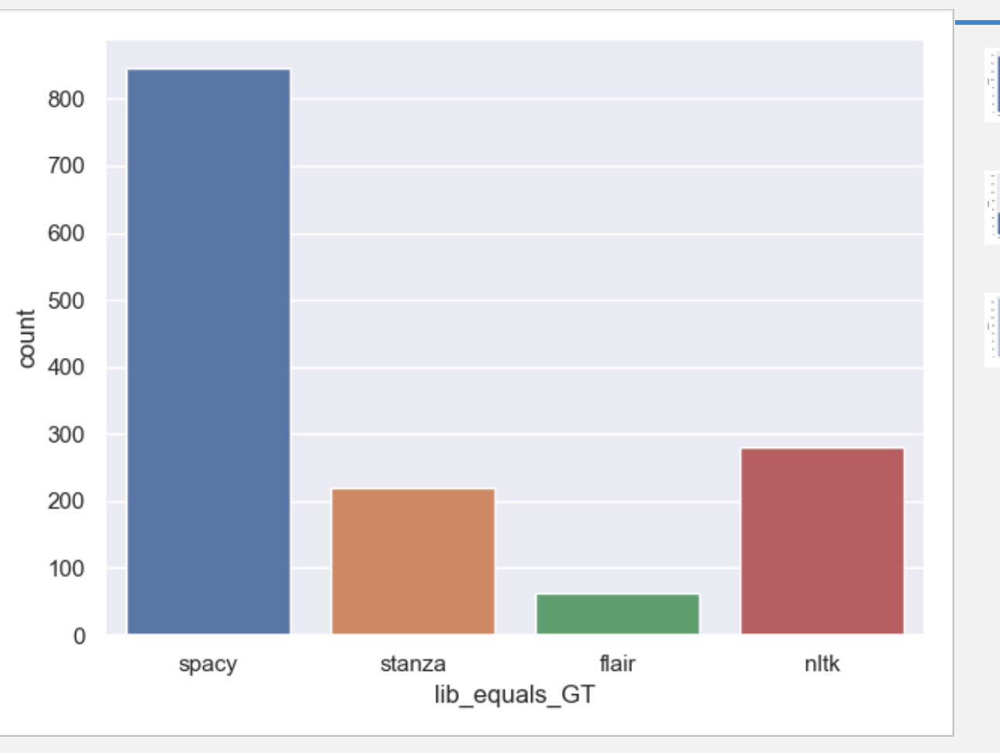
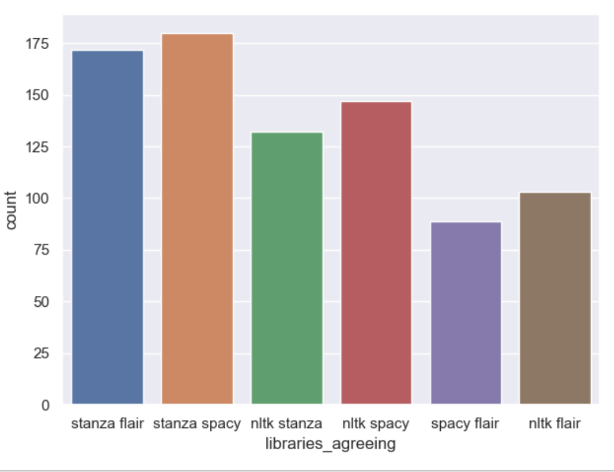
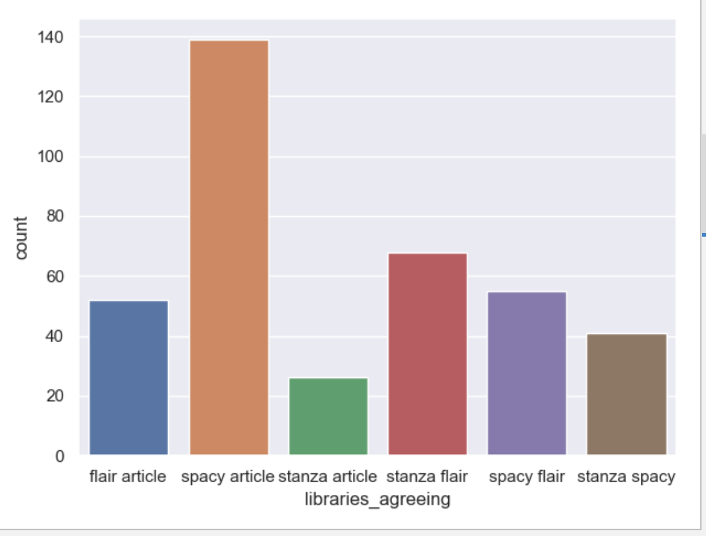

# pos_taggers_evaluation

First of all, some figures: around 47.000 in total over the 1007 sentences. Only around 12.000 where there are disagreements between the 5 votes (including GT).

- First simple rule: when 4 agree and the GT is different : we take the libraries predictions except for PROPN (GT) /NOUN (libraries) (we take PROPN 
because usually thr GT is right in this case)
===> it's around 2.000 cases

- When 4 agree including the GT and an other library gives an other vote : here is the repartition of libraries agreeing with the GT:

First, we can see that spacy tends to be different and agree with the GT against the other libraries. It's the only library using
the universal tagging so this situation itself can introduce a bias, and the mapping I am using as well.
From my reviewing (I review mainly disagreements VERB/NOUN-PROPN), the 4 votes are often true but I found some examples where stanza is the remaining one and it's true (for example 
"decoding" in the sentence "URL decoding in Javascript" is an example), same for spacy and flair. Even if these are few cases I would quickly review 
the tokens here (that's what I will do). 

- When 3 agree, there are 2 uniques votes given and the GT is different and agrees with an other library: usually it agrees with spacy (and usually the combinaison 
nltk-stanza-flair is right but it's worth reviewing), when it agrees with flair the GT usually seems always right, when it agrees with nltk the GT is usually wrong 
and with stanza usually the GT is true (it was checked on a sample)
==> I'll review the cases here

- When 3 agree, there are 3 unique votes given and the GT is different: we take the libraries predictions except for PROPN/NOUN libke before

- 3 agree, 2 uniques values and same GT: here are the repartition of the libraries agreeing in the remaining votes.
 To be honest here it's worth reviewing because I did not find some rule to be used (and as the next analysis will be based on the labels here
 I don't to have too many wrongly tagged elements)

- 3 agree, 3 uniques values and same GT: we can take the GT from what I have seen

- 2 agree, 4 unique values and different GT: we can take the GT (it's mainly garbbage) 

- 2 agree 3 unique different GT: here are the repartition of the libraries (can include the article) agreeing in the remaining votes:

- 2 agree, 4 unique values and same GT: it's worth reviewing here and there are not so many elements

- 2 agree, 3 unique values and same GT: here are the repartition of the libraries agreeing in the remaining votes:

- all the libraries disagree: few cases - garbbage:  we take theGT

After taking into account some of the recommendations here, we reduce the number of tokens to around 9.000, and Basel did 5.285 of them (I 
still have to do around 4.000). Let's go!

Next step: the report regarding the libraries performances
